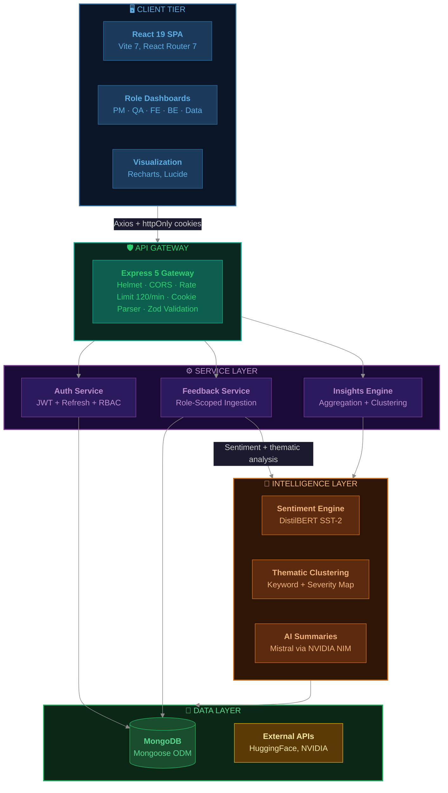
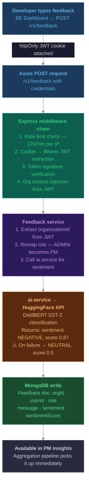
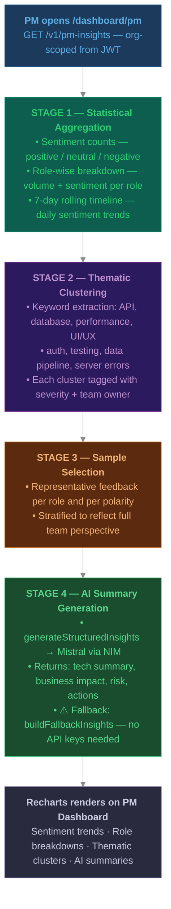
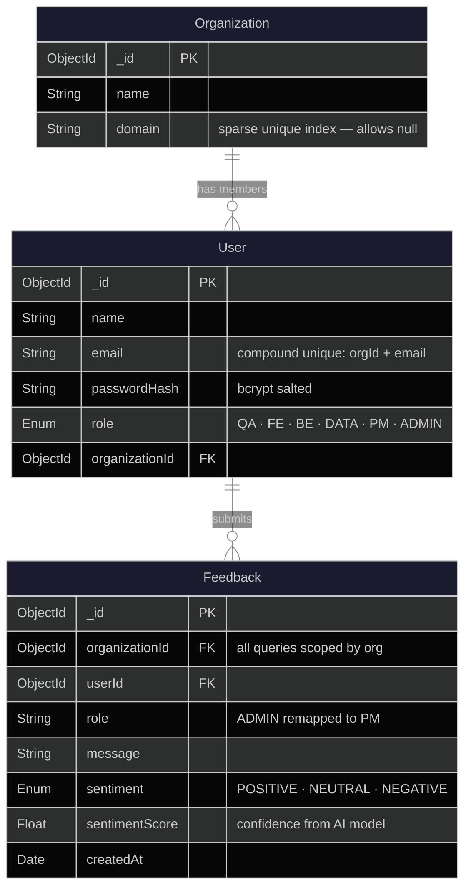

# PROD PILOT

**Pre-development decision intelligence for product teams.**

[](LICENSE)
[](https://nodejs.org)
[](https://www.mongodb.com)
[](https://react.dev)
[](https://expressjs.com)

---

## Why This Exists

I've seen teams burn weeks building features that should've been flagged in the first conversation. The QA lead knew there'd be edge cases. The backend dev knew the API couldn't handle it. The data engineer knew the pipeline would choke. But none of that reached the PM before sprint planning — it lived in Slack threads, standup side-conversations, and "I told you so" moments after the fact.

PROD PILOT fixes that gap. It captures structured, role-specific feedback from every engineering function **before** a single line of production code gets written. Instead of decisions based on gut feeling and meeting notes, PMs get quantified sentiment, clustered themes, severity scores, and AI-generated summaries — a real decision surface.

Think of it as the **intelligence layer that sits upstream of Jira or Linear**. Feasibility thinking happens here. Task management happens downstream.

### Where Things Stand

The **feedback system is fully built and production-ready** — role-based collection, sentiment analysis, PM insights dashboards, the whole pipeline. What I'm building next is the **decision intelligence engine** — go/no-go scoring, dependency mapping, and risk assessment that turns raw feedback into actual recommendations.

---

## System Architecture

Here's the full picture — how every layer connects, from the React frontend down to the data store:



---

## Request Lifecycle

What happens when a backend engineer submits feedback saying *"The current API can't handle the projected load"*:



---

## PM Insights Pipeline

When a PM opens their dashboard — a 4-stage MongoDB aggregation pipeline fires:



---

## Data Models

How the three core entities relate — with indexing strategies that enforce multi-tenancy at the schema level:



---

## Auth Flow

Dual-token JWT rotation with cookie-first resolution:

```mermaid
%%{init: {'theme': 'dark', 'themeVariables': {'primaryColor': '#1B3A5C', 'primaryTextColor': '#5DADE2', 'primaryBorderColor': '#2E6B9E', 'lineColor': '#8B8B8B', 'background': '#1a1b2e', 'mainBkg': '#1a1b2e', 'edgeLabelBackground': '#1a1b2e'}}}%%

graph TD
    subgraph BOOTSTRAP["🏗️ First-Time Org Bootstrap"]
        B1["POST /v1/auth/admin/signup<br/>{ name, email, password, orgName }"] --> B2["Creates Organization +<br/>first ADMIN user atomically"]
        B2 --> B3["Returns JWT pair as httpOnly cookies"]
    end

    subgraph LOGIN["🔐 Normal Login"]
        L1["POST /v1/auth/login<br/>{ email, password }"] --> L2["bcrypt.compare<br/>password vs hash"]
        L2 -->|"✅ Match"| L3["Sign JWT pair +<br/>set httpOnly cookies"]
        L2 -->|"❌ No match"| L4["401 Unauthorized"]
    end

    subgraph MIDDLEWARE["🔄 Every Subsequent Request"]
        M1["Read JWT from cookie<br/>or Authorization header"] --> M2["Verify signature"]
        M2 --> M3["Inject userId + orgId + role<br/>into request context"]
        M3 --> M4["Route handler executes<br/>with full auth context"]
    end

    subgraph INVITE["👥 Adding Team Members"]
        I1["POST /v1/invite<br/>admin-only route"] --> I2{"req.role === ADMIN?"}
        I2 -->|"✅ Yes"| I3["Create User under same orgId"]
        I2 -->|"❌ No"| I4["403 Forbidden"]
    end

    style B1 fill:#1B3A5C,stroke:#2E6B9E,color:#5DADE2
    style B2 fill:#0D5E4F,stroke:#17A589,color:#2ECC71
    style B3 fill:#0D5E4F,stroke:#17A589,color:#2ECC71
    style L1 fill:#1B3A5C,stroke:#2E6B9E,color:#5DADE2
    style L2 fill:#2C1A5E,stroke:#7D3C98,color:#BB8FCE
    style L3 fill:#1A4D2E,stroke:#27AE60,color:#58D68D
    style L4 fill:#4A1A1A,stroke:#E74C3C,color:#F1948A
    style M1 fill:#2A2A3E,stroke:#555580,color:#CACAE0
    style M2 fill:#2A2A3E,stroke:#555580,color:#CACAE0
    style M3 fill:#2A2A3E,stroke:#555580,color:#CACAE0
    style M4 fill:#2A2A3E,stroke:#555580,color:#CACAE0
    style I1 fill:#1B3A5C,stroke:#2E6B9E,color:#5DADE2
    style I2 fill:#2C1A5E,stroke:#7D3C98,color:#BB8FCE
    style I3 fill:#1A4D2E,stroke:#27AE60,color:#58D68D
    style I4 fill:#4A1A1A,stroke:#E74C3C,color:#F1948A

    style BOOTSTRAP fill:#0a1628,stroke:#2E6B9E,stroke-width:2px,color:#5DADE2
    style LOGIN fill:#0a1628,stroke:#2E6B9E,stroke-width:2px,color:#5DADE2
    style MIDDLEWARE fill:#1a1a2e,stroke:#555580,stroke-width:2px,color:#CACAE0
    style INVITE fill:#0a1628,stroke:#2E6B9E,stroke-width:2px,color:#5DADE2
```



---

## Under The Hood

### How Auth Actually Works

I went with a **dual-token rotation** approach because single-token JWTs are either too short-lived (annoying) or too long-lived (insecure).

The middleware checks `httpOnly` cookies first, then falls back to the `Authorization: Bearer` header. This means the React SPA works seamlessly with cookie-based auth while external integrations (Postman, scripts, future webhooks) can use header-based auth without any code changes.

Admin signup is a bootstrap operation — it creates the organization and the first user atomically. After that, every new user gets added through the invite route, which is locked behind admin middleware. There's no open registration. You either bootstrap the org or get invited.

### How Feedback Ingestion Works

Every feedback submission goes through the same pipeline: authenticate → extract org from JWT → determine role → score sentiment → persist.

One non-obvious decision: when an ADMIN submits feedback, it gets stored as `PM` role. This was intentional. Admins are usually the person who set up the org — typically the PM or founder. Storing their feedback as "ADMIN" would pollute the role-based analytics since "ADMIN" isn't an engineering function. The `ROLE_DISPLAY_MAP` in the feedback service handles this transparently.

Sentiment scoring happens via the HuggingFace Inference API running DistilBERT SST-2 — a lightweight but surprisingly accurate model for binary/ternary sentiment classification. If the API call fails (rate limits, network issues, key not configured), the system doesn't crash — it just labels the feedback as `NEUTRAL` with a confidence score of `0.5` and moves on. I'd rather have slightly less accurate sentiment data than a broken feedback pipeline.

### How The Insights Engine Works

This is where things get interesting. When a PM hits `/v1/pm-insights`, it triggers a multi-stage MongoDB aggregation pipeline:

**Stage 1** runs basic counts — how many positive, neutral, negative submissions exist, broken down by role and plotted on a 7-day timeline.

**Stage 2** does thematic clustering. Feedback messages get scanned against keyword maps for eight categories: API, database, performance, UI/UX, data pipeline, authentication, testing, and server errors. Each cluster gets a severity tag and a team assignment, so the PM can see "there are 12 performance concerns, mostly from Backend, tagged as high severity."

**Stage 3** pulls representative samples — a few feedback messages from each role and each sentiment bucket. This gives the PM actual quotes to reference, not just numbers.

**Stage 4** sends everything to Mistral (via NVIDIA NIM) and asks for structured JSON back — technical summary, business impact, risk assessment, recommended actions. If the API key isn't configured or the call fails, `buildFallbackInsights()` generates the same structure from deterministic rules. The PM dashboard renders identically either way.

### Multi-Tenancy Without Complexity

I didn't want to deal with separate databases or schema-per-tenant overhead for what's still a growing product. Instead, every document carries an `organizationId` and every query filters by it — injected from the JWT, not from user input. The compound unique index on `(organizationId, email)` means the same email can exist in different orgs without collision.

The `Organization` model has an optional `domain` field with a sparse unique index. Sparse because most orgs won't set a domain, and unique because those that do shouldn't conflict.

---

## API Reference

Base URL: `/v1`

### Authentication

| Method | Endpoint | What it does | Auth |
|--------|----------|--------------|------|
| `POST` | `/v1/auth/admin/signup` | Creates org + first admin user | Public |
| `POST` | `/v1/auth/login` | Returns JWT pair as cookies | Public |
| `POST` | `/v1/auth/logout` | Clears session cookies | Public |
| `POST` | `/v1/auth/refresh` | Rotates access token | Refresh token |

### User Management

| Method | Endpoint | What it does | Auth |
|--------|----------|--------------|------|
| `POST` | `/v1/invite` | Invite user to org with specified role | Admin only |

### Feedback

| Method | Endpoint | What it does | Auth |
|--------|----------|--------------|------|
| `POST` | `/v1/feedback` | Submit feedback (auto-scored for sentiment) | Authenticated |
| `GET` | `/v1/feedback` | List all feedback for your org | Authenticated |

### Analytics & Insights

| Method | Endpoint | What it does | Auth |
|--------|----------|--------------|------|
| `GET` | `/v1/analytics` | Sentiment distribution, keyword clusters | Authenticated |
| `GET` | `/v1/insights` | Executive roll-up: health score, risk level | Authenticated |
| `GET` | `/v1/pm-insights` | Full PM package: stats, timeline, clusters, AI summaries | Authenticated |

### Health

| Method | Endpoint | What it does |
|--------|----------|--------------|
| `GET` | `/health` | `{ ok: true }` — use for uptime checks |

---

## Folder Structure

```
PROD-PILOT/
├── backend/
│   ├── src/
│   │   ├── server.js                 # Loads dotenv, connects DB, starts listening
│   │   ├── app.js                    # Middleware stack + route mounting
│   │   ├── config/                   # DB connection, env helpers
│   │   ├── middleware/
│   │   │   ├── auth.js               # Cookie-first JWT extraction + verify
│   │   │   ├── admin.js              # Rejects non-ADMIN before handler runs
│   │   │   └── error.js              # Catches everything, returns clean JSON
│   │   ├── models/
│   │   │   ├── Organization.js       # name, domain (sparse unique)
│   │   │   ├── User.js               # compound unique (orgId + email), 6 roles
│   │   │   └── Feedback.js           # org-scoped, sentiment-scored
│   │   ├── routes/
│   │   │   ├── auth.routes.js        # signup, login, logout, refresh
│   │   │   ├── invite.routes.js      # admin-only user invitation
│   │   │   ├── feedback.routes.js    # submit + list
│   │   │   ├── analytics.routes.js   # aggregated stats
│   │   │   ├── insights.routes.js    # executive roll-up
│   │   │   └── pmInsights.routes.js  # full PM insights package
│   │   ├── services/
│   │   │   ├── feedback.service.js   # Ingestion logic + role remapping
│   │   │   ├── ai.service.js         # HF sentiment + NIM structured summaries
│   │   │   └── insights.service.js   # Aggregation pipelines + clustering
│   │   └── utils/                    # Token helpers, constants, role maps
│   ├── .env.example                  # Template — never commit the real .env
│   └── package.json
├── frontend/
│   ├── src/
│   │   ├── pages/
│   │   │   ├── Login.jsx
│   │   │   ├── Signup.jsx            # Admin org bootstrap
│   │   │   ├── Dashboard.jsx         # Role picker — routes to specific view
│   │   │   ├── PMDashboard.jsx       # Consumes /pm-insights
│   │   │   ├── QADashboard.jsx       # Feedback submit + view
│   │   │   ├── FEDashboard.jsx
│   │   │   ├── BEDashboard.jsx
│   │   │   └── DataDashboard.jsx     # /pm-insights + /feedback
│   │   ├── services/
│   │   │   └── api.js                # Axios with withCredentials + base URL
│   │   └── App.jsx                   # React Router 7 route definitions
│   ├── vite.config.js
│   └── package.json
├── package.json                       # Root — backend deps hoisted here
├── LICENSE
└── README.md
```

---

## Stack

| Layer | What | Why |
|-------|------|-----|
| Frontend | React 19, Vite 7, React Router 7 | Fast builds, code-split dashboards, modern routing |
| Charts | Recharts, Lucide React | Clean sentiment visualizations, lightweight icons |
| HTTP | Axios (`withCredentials: true`) | Cookie auth works out of the box, interceptors ready |
| Server | Express 5, Node.js (CommonJS) | Stable, well-tested, easy to extend |
| Validation | Zod | Runtime schema checks — catches malformed payloads before they hit the DB |
| Auth | jsonwebtoken + bcrypt | Industry-standard token signing + password hashing |
| Database | MongoDB + Mongoose | Flexible documents, strong ODM for schema enforcement |
| Sentiment | HuggingFace Inference (DistilBERT SST-2) | Lightweight, accurate for ternary sentiment, free tier works |
| Summaries | NVIDIA NIM API (Mistral) | Structured JSON output from aggregated data |
| Security | Helmet, CORS, express-rate-limit | Defense-in-depth — headers, origin control, throttling |

---

## Environment Setup

Copy the template and fill in your values:

```bash
cp backend/.env.example backend/.env
```

| Variable | Required | Default | What it controls |
|----------|----------|---------|------------------|
| `PORT` | Yes | `4000` | Server port |
| `MONGO_URI` | Yes | — | Your MongoDB connection string |
| `JWT_SECRET` | Yes | — | Signs access tokens (keep this long and random) |
| `JWT_REFRESH_SECRET` | Yes | — | Signs refresh tokens (different from access secret) |
| `JWT_EXPIRES_IN` | Yes | `15m` | How long access tokens last |
| `JWT_REFRESH_EXPIRES_IN` | Yes | `7d` | How long refresh tokens last |
| `COOKIE_SECURE` | No | `false` | Set `true` when running behind HTTPS |
| `CORS_ORIGIN` | Yes | — | Comma-separated frontend origins |
| `HF_API_KEY` | No | — | Enables AI sentiment — without it, defaults to NEUTRAL |
| `NVIDIA_API_KEY` | No | — | Enables AI summaries — without it, uses rule-based fallback |

The platform works completely without the AI keys. You get manual sentiment labeling fallbacks and deterministic insights instead of AI-generated ones. Not ideal, but functional.

---

## Running Locally

### What you need

- Node.js 18+
- MongoDB (local install or Atlas free tier)
- npm 9+

### Start the backend

```bash
git clone https://github.com/Adinair01/PROD-PILOT.git
cd PROD-PILOT
cp backend/.env.example backend/.env
# Edit backend/.env — at minimum set MONGO_URI and JWT secrets
npm install
npm run dev
```

Hit `http://localhost:4000/health` — you should get `{ ok: true }`.

### Start the frontend

```bash
cd frontend
npm install
npm run dev
```

Opens at `http://localhost:5173`. Make sure your `CORS_ORIGIN` includes this URL.

### Your first session

1. **Bootstrap your org** — `POST /v1/auth/admin/signup` with `{ name, email, password, orgName }`. This creates the organization and your admin account in one shot.
2. **Log in** — `POST /v1/auth/login`. Cookies get set automatically.
3. **Invite your team** — `POST /v1/invite` with each member's email, name, and role (QA, FE, BE, DATA).
4. **Collect feedback** — team members log in and submit through their role-specific dashboards.
5. **Check insights** — open the PM dashboard at `/dashboard/pm`. Everything aggregates in real time.

---

## Security

I took a defense-in-depth approach rather than relying on any single mechanism:

| What | How | Why it matters |
|------|-----|----------------|
| HTTP headers | Helmet | Prevents XSS, clickjacking, MIME sniffing attacks |
| Origin control | CORS with configurable whitelist | Only your frontend can talk to your API |
| Throttling | 120 req/min per IP | Stops brute-force and scraping attempts |
| Auth tokens | JWT with HS256 signing | Stateless, verifiable, expires predictably |
| Passwords | bcrypt with salt | Even if the DB leaks, passwords stay protected |
| Input validation | Zod schemas on auth routes | Malformed payloads die before touching business logic |
| Data isolation | Org-scoped queries from JWT | Tenants can't see each other's data, period |
| Admin operations | Role middleware | Non-admins get 403'd before the handler even runs |

---

## Deploying to Production

Works on Render, Railway, AWS ECS, or anything that runs Node.

1. **Set env vars in your hosting provider** — never commit `.env` files.
2. **Enable HTTPS** and set `COOKIE_SECURE=true` — httpOnly cookies need this in production.
3. **Point `CORS_ORIGIN`** at your production frontend domain.
4. **Use MongoDB Atlas** — free tier is fine for starting out, replica sets recommended for production.
5. **Optional**: add `HF_API_KEY` and `NVIDIA_API_KEY` for AI features.

---

## What's Done, What's Next

### Shipped
- [x] Multi-tenant org system with sparse indexing
- [x] Dual-token JWT auth with cookie-first resolution
- [x] RBAC across 6 roles with admin-only invite flow
- [x] Role-scoped feedback ingestion with org isolation
- [x] AI sentiment analysis via DistilBERT SST-2 (with graceful fallback)
- [x] PM insights engine — aggregation, clustering, severity mapping
- [x] AI-generated structured summaries via Mistral (with rule-based fallback)
- [x] Five role-specific dashboards with Recharts visualization

### Building Now — Decision Intelligence Engine
- [ ] Go/no-go scoring with weighted multi-signal evaluation
- [ ] Cross-role dependency mapping and conflict detection
- [ ] Priority ranking with configurable signal weights
- [ ] Risk assessment with historical trend comparison
- [ ] Notification system for critical risk flags
- [ ] Webhook integrations for downstream tools (Jira, Linear)

---

## Contributing

```bash
git checkout -b feature/your-feature
git commit -m "feat: what you changed and why"
git push origin feature/your-feature
# Open a PR — describe the problem it solves, not just the code it changes
```

---

## License

MIT — see [LICENSE](LICENSE).

---

Built by [Aditya Nair](https://github.com/Adinair01) · Research project under Prof. Uma.M, SRMIST
